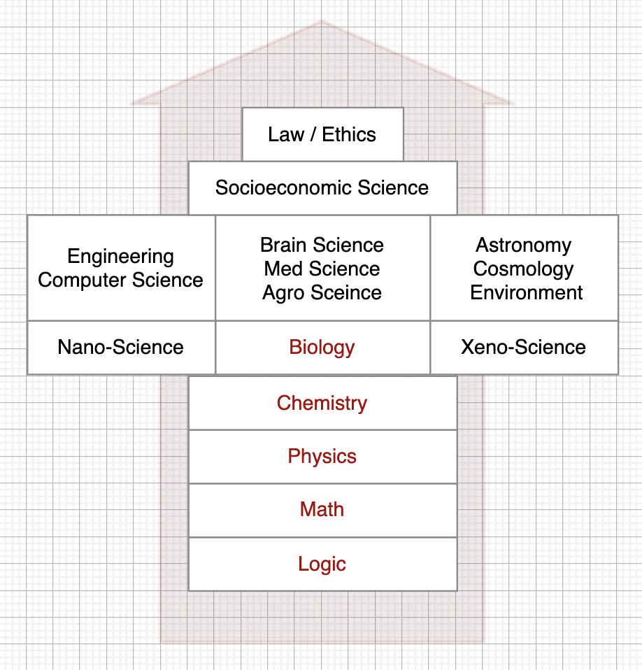

# Books 

##  Introduction
This is the list of books that cover the core, timeless, ideas that change the way you see the world and improve your thinking. The list is highly inspired by the [Great Mental Model Project](https://fs.blog/tgmm/) and by the [Navals Ravikant's](https://www.navalmanack.com/navals-recommended-reading) reading list. It is important to read good books in the right order. The 'right' order is the bottom-up order, meaning starting from the most fundamental and moving to more advanced topics.

<table width="256px">
  <tr>
    <td></td>
  </tr>
  <tr><td align="center">Hierarchy of the Sciences</td></tr>
</table>  

## Math & Logic
- [Critical Thinking & Logic Mastery by Thinknetic](./critical-thinking-logic/)
- [Logic: A Very Short Introduction by Graham Priest](https://www.amazon.com/Logic-Very-Short-Introduction-Introductions-ebook/dp/B075KB9C3W/ref=tmm_kin_swatch_0?_encoding=UTF8&qid=&sr=)
- [Introduction to Mathematical Philosophy by Bertrand Russell](https://amazon.com/Introduction-Mathematical-Philosophy-Bertrand-Russell-ebook/dp/B09Y5LNHL9/ref=sr_1_1?crid=2M5WXZ21HBOXN&keywords=Introduction+to+Mathematical+Philosophy&qid=1692297327&sprefix=introduction+to+mathematical+philosophy%2Caps%2C320&sr=8-1)
- [The Book of Mathematical Principles, Theories & Things by Robert Solomon ](https://www.amazon.com/Little-Mathematical-Principles-Theories-Things-ebook/dp/B09NPBQR7Z/ref=zg_bs_g_159760011_sccl_1/134-1659129-0569007?psc=1#customerReviews)

## Physics
- [Six Easy Pieces by R.Feynmann](./six-easy-pieces/)
- [Six Not-So-Easy Pieces by R.Feynmann](https://www.amazon.com/Six-Not-So-Easy-Pieces-Einstein%C2%92s-Relativity/dp/0465025269/ref=pd_bxgy_img_sccl_1/141-0597453-4528805?pd_rd_w=xJbAD&pf_rd_p=6b3eefea-7b16-43e9-bc45-2e332cbf99da&pf_rd_r=H0HJ5P4VTYHZ0DHMDAT7&pd_rd_r=02460b82-28c5-4314-8061-59ade3815d13&pd_rd_wg=huVci&pd_rd_i=0465025269&psc=1)
- [The Fabric of Reality: The Science of Parallel Universes - and Its Implications by D.Deutsch](https://www.amazon.com/The-Fabric-of-Reality-audiobook/dp/B07L5XWD7X/ref=sr_1_1?crid=2B7Y3MVVA6X57&keywords=the+fabric+of+reality&qid=1684136431&sprefix=the+fabric+of+reality%2Caps%2C226&sr=8-1)
- [The Beginning of Infinity: Explanations That Transform the World by D.Deutsch](https://www.amazon.com/The-Beginning-of-Infinity-audiobook/dp/B005HTYBCM/ref=sr_1_4?crid=2B7Y3MVVA6X57&keywords=the+fabric+of+reality&qid=1684136469&sprefix=the+fabric+of+reality%2Caps%2C226&sr=8-4)

## Chemistry
- [The Elements We Live By](https://www.amazon.com/Elements-Live-Potassium-Surprising-Superpowers-ebook/dp/B07WK5PXX8/ref=zg_bs_13570_2/141-0597453-4528805?pd_rd_i=B07WK5PXX8&psc=1)
- [Chemistry Made Easy](https://www.amazon.com/Chemistry-Made-Easy-Illustrated-Students/dp/1952914051/ref=zg_bs_13570_7/141-0597453-4528805?pd_rd_i=1952914051&psc=1)

## Biology
- [The Origin Of Species by C.Darwin](https://www.amazon.com/Origin-Species-150th-Anniversary-ebook/dp/B002JF1N0A/ref=sr_1_1?crid=2X7AD1IYNKQF3&keywords=darwin&qid=1649534334&s=digital-text&sprefix=darwin%2Cdigital-text%2C222&sr=1-1)

## Engineering & CS
- [Computer Science curriculum](.books/my-recommended-books/cs-curriculum.md)
- [Structured Computer Organization](https://www.amazon.com/gp/product/B00IZ0B7YA/ref=dbs_a_def_rwt_hsch_vapi_taft_p1_i1)
- [Modern Operating Systems](https://www.amazon.com/gp/product/B013ROUMBM/ref=dbs_a_def_rwt_hsch_vapi_taft_p1_i4)
- [Computer Networks](https://www.amazon.com/gp/product/0132126958/ref=dbs_a_def_rwt_hsch_vapi_taft_p1_i3)
- [Data Structures and Algorithms in Python](./python-data-structures/)
- [Clean Architecture](./clean-architecture/)
- [Design Patterns](https://www.amazon.com/Design-Patterns-Elements-Reusable-Object-Oriented/dp/0201633612/ref=sr_1_1?keywords=design+patterns&qid=1650258328&s=books&sprefix=design+pa%2Cstripbooks-intl-ship%2C286&sr=1-1) 

## Psychology
- [Psychology: A Complete Introduction](https://www.amazon.com/Psychology-Complete-Introduction-Teach-Yourself-ebook/dp/B012DFWI4A/ref=sr_1_14?crid=NUY9QDK9NFGB&keywords=psychology&qid=1649534670&s=digital-text&sprefix=psychology%2Cdigital-text%2C217&sr=1-14)
- [The Stoic Challenge: A Philosopher's Guide to Becoming Tougher, Calmer, and More Resilient](https://www.amazon.com/Stoic-Challenge-Philosophers-Becoming-Resilient-ebook/dp/B07P9DC6TY/ref=tmm_kin_swatch_0?_encoding=UTF8&qid=1649534731&sr=8-2)

## Sociology
- [How to Win Friends & Influence People](https://www.amazon.com/How-Win-Friends-Influence-People/dp/B0006IU7JK/ref=sr_1_1?keywords=dale+carnegie&qid=1649534970&s=books&sprefix=dale+ca%2Cstripbooks-intl-ship%2C194&sr=1-1)
- [The Good Life: Lessons from the World's Longest Scientific Study of Happiness](https://www.amazon.com/Good-Life-Lessons-Scientific-Happiness/dp/198216669X/ref=zg_bs_g_282914_sccl_3/134-1659129-0569007?psc=1)

## Economics
- [The Wealth of Nations](https://www.amazon.com/Wealth-Nations-Adam-Smith-ebook/dp/B08NPXBLYQ/ref=sr_1_1?crid=1MIER4Z2V7R2C&keywords=wealth+of+nations&qid=1649534408&s=digital-text&sprefix=wealth%2Cdigital-text%2C211&sr=1-1)
- [Capital: Volume I](https://www.amazon.com/Capital-Critique-Political-Economy-Kapital-ebook/dp/B002XHNMN0/ref=tmm_kin_swatch_0?_encoding=UTF8&qid=1649534564&sr=1-1)
- [The Intelligent Investor by Benjamin Graham](https://www.amazon.com/Intelligent-Investor-Definitive-Investing-Essentials/dp/0060555661/ref=sr_1_1?keywords=the+intelligent+investor&qid=1692300032&sprefix=the+inte%2Caps%2C237&sr=8-1)
- [How the World Really Works: The Science Behind How We Got Here and Where We're Going](./how-the-world-works/)

## Law & Ethics
- [The Theory of Moral Sentiments by A.Smith](./books/the-theory-of-moral-sentiments/README.md)
- [The Declaration of Independence](https://www.amazon.com/Declaration-Independence-Thomas-Jefferson-ebook/dp/B00KZFPG9K/ref=sr_1_7?keywords=the+declaration+of+independence&qid=1693566221&sprefix=the+decla%2Caps%2C222&sr=8-7)

## Appendix 1: Mental Models
- [The Great Mental Models Volume 1,2,3: General Thinking Concepts](https://www.amazon.com/gp/product/B07P79P8ST/ref=as_li_qf_asin_il_tl?tag=farnamstreet-20&ie=UTF8&linkId=883df32fb862d9a4407c00d334c46272&geniuslink=true)

## Appendix 2: How to Learn
- [Make It Stick: The Science of Successful Learning](https://www.amazon.com/Make-Stick-Peter-C-Brown-ebook/dp/B00JQ3FN7M/ref=sr_1_1?crid=1RXR8D5UCJL8T&keywords=Make+It+Stick%3A+The+Science+of+Successful+Learning&qid=1649536700&s=digital-text&sprefix=make+it+stick+the+science+of+successful+learning%2Cdigital-text%2C286&sr=1-1)
- [How to Read a Book by Doren and Adler](https://www.amazon.com/How-Read-Book-Touchstone-ebook/dp/B004PYDAPE/ref=sr_1_1?keywords=how+to+read+a+book&qid=1692299621&s=digital-text&sprefix=how+to+read+a+%2Cdigital-text%2C242&sr=1-1)

