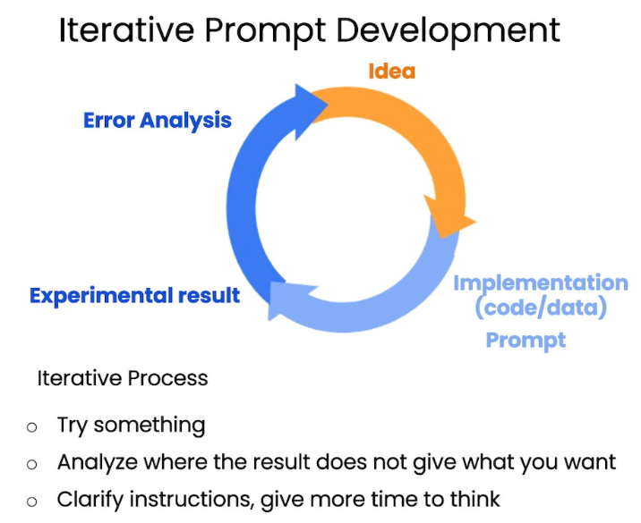

# [ChatGPT Prompt Engineering for Developers](https://learn.deeplearning.ai/chatgpt-prompt-eng/)

## Background
ChatGPT is an innovative AI tool that boosts productivity in learning, writing, and coding. However, using ChatGPT can be challenging, requiring specific instructions to achieve accurate results. For instance, asking ChatGPT about 'John Smith' without specifying the context can lead to ambiguity, considering various individuals with the same name. This course empowers developers with effective techniques to prompt, summarize, transform, and expand texts using the ChatGPT API, enabling the creation of novel applications through the integration of programming skills and ChatGPT.

## Iterative Promt Development
Employ an experimental learning approach with ChatGPT by iteratively trying different queries, observing the results, and analyzing them. If the obtained output is unsatisfactory, refine the query to enhance the desired outcome.

<table width="256px">
  <tr>
    <td></td>
  </tr>
</table>

## Summarizing
Summarizing is the most popular use cases for ChatGPT. For example, summarization is essential feature in any free text analytics systems. Think about sales assistant, that can summarize all phone calls to a specific customer. Another great example is summarization of articles and books for students. 

## Inferring
ChatGPT is useful for sentiments and topics inferring from the free text is.
