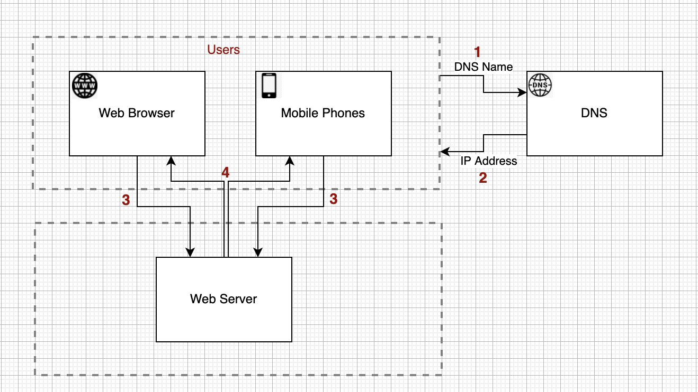
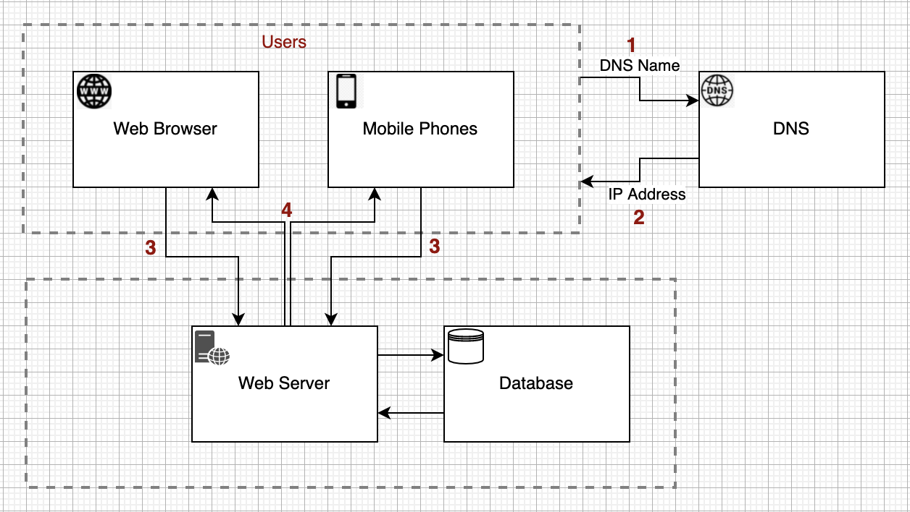
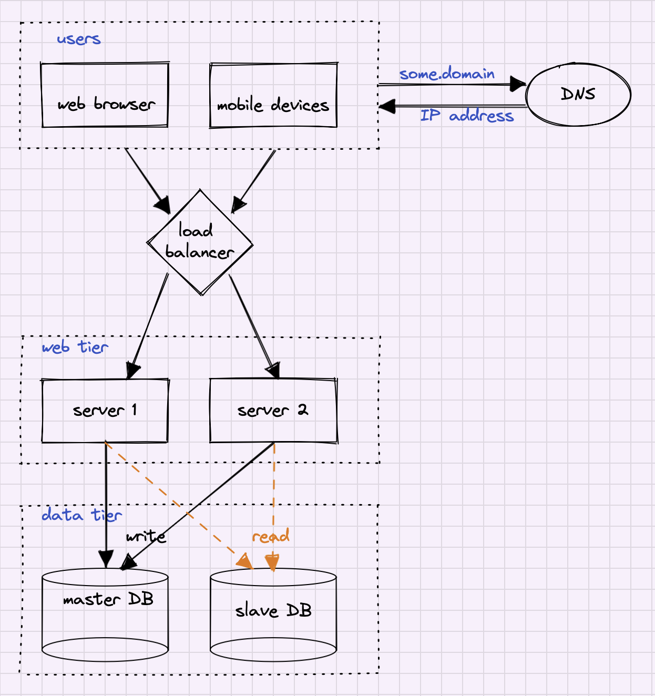

# CHAPTER 1: SCALE FROM ZERO TO MILLIONS OF USERS

## Introduction
This chapter focuses on the foundations of high-scale architecture. One of the best ways of learning architecture patterns is to design a single server system and then gradually scale it up to support more load.

## Single Server Setup
The Single Server setup is simple - all components, like web servers, databases, caches, etc are running on a single machine. 
<table width="256px">
  <tr>
    <td></td>
  </tr>
</table>
  
The flow is straightforward as well:
- User accesses the web server by using the domain name from a browser or a smartphone 
- The domain name is resolved in some a DNS server like [Route53](https://en.wikipedia.org/wiki/Amazon_Route_53) or [OpenDNS](https://en.wikipedia.org/wiki/OpenDNS).
- Once the IP is obtained, an HTTP request is sent to the Web Server
- Web Server responses by sending HTML or JSON 

## Database
When the traffic increases, one server is not enough. It makes sense to separate the Web Tier and the Database Tier. Such a separation will allow to scale out each tier independently. 
<table width="256px">
  <tr>
    <td></td>
  </tr>
</table>

## Which databases to use?
There are two types of databases: [Relational](https://en.wikipedia.org/wiki/Relational_database) (SQL) and [NoSQL](https://en.wikipedia.org/wiki/NoSQL) databases. Relational databases organize the data in tables with relations. For example, think about an online e-commerce system. We can organize the data in Customers and Orders tables, where for each customer, there are multiple entries in the Orders Table (aka one-to-many relation). An [SQL language](https://www.w3schools.com/sql/sql_intro.asp) is used to query the data in Relational Databases. The most popular Relation Databases are MySQL, Oracle, PostgreSQL.
NoSQL databases are comparably new and used when dealing with unstructured data, huge volumes of data, or when a low-latency data access is required. There are four families of NoSQL databases
- Key-Value databases
- Document databases 
- Graph Databases
- Column Databases  

Some popular NoSQL databases are CouchDB, DynamoDB, Cassandra. Neo4j, Redis, etc.

## Vertical scaling vs horizontal scaling
We can increase the power of the software component by scaling it [up](https://en.wikipedia.org/wiki/Scalability) (Vertical) or [out](https://en.wikipedia.org/wiki/Scalability) (Horizontal). Scaling up is just adding additional hardware. For example, we scale up a MySQL database by increasing the number of CPU cores of the underlying server. On the other hand, we can scale out software components by increasing the number of underlying servers. For example, we scale out MongoDB by increasing the number of underlying machines. 
Each of the methods has its limitation. We cannot scale up [infinitely](). There are certain hard limits for the number of CPU cores, RAM, and network bandwidth on each server. Another point is that the Vertical scaling doesn't have failover or redundancy. The Horizontal Scaling doesn't work in some cases too. Some software components (example: Relational Databases) cannot scale out. 

## Load balancer
A load balancer distributes incoming traffic among web servers defined in a load-balanced set. A load balancer is a crucial component to implement High Availability and Redundant systems.
1. Example 1: users will be unable to access the website if the server goes down. In this case a Load Balancer can be used to build an active-passive setup. A Load Balancer will rout the traffic to the active server and in case of server's failure the traffic will go to the second server.  
2. Example 2: The server will reach its capacity when the traffic spikes. In this case a Load Balancer can be used to build an active-active setup. The traffic will be distributed between two servers. Optionally, we can setup an autoscale to add server as traffic growth.

<table width="256px">
  <tr>
    <td></td>
  </tr>
</table>

Below is a quick overview of the most coined terms in cloud or data storage services.
- [Fault tolerance](https://sprinkle-twinkles.medium.com/availability-vs-reliability-vs-durability-vs-resiliency-dfead8c92c58) - ability that allows systems to function even when one of its components fails. Ussually achieved by [redundancy](https://en.wikipedia.org/wiki/Redundancy_(engineering)) 
- [Availability](https://sprinkle-twinkles.medium.com/availability-vs-reliability-vs-durability-vs-resiliency-dfead8c92c58) - is the system uptime. For example, High-Availablity on AWS Service usually means that it is available more than 99.9% of the time.
- [Reliability](https://sprinkle-twinkles.medium.com/availability-vs-reliability-vs-durability-vs-resiliency-dfead8c92c58) - is closely related to availability, however, a system can be ‘available’ but not be working properly. Reliability is the probability that a system will work as designed.
- [Resilience](https://sprinkle-twinkles.medium.com/availability-vs-reliability-vs-durability-vs-resiliency-dfead8c92c58) - described as the ability to a system to self-heal after damage, failure, load, or attack.
- [Durability](https://sprinkle-twinkles.medium.com/availability-vs-reliability-vs-durability-vs-resiliency-dfead8c92c58) - refers to the on-going existence of the object or resource

## Database replication
The database replication is achieved using the [master-slave](https://en.wikipedia.org/wiki/Master/slave_(technology)) technique. The Master node is usually used for writes only. And Slave replicas are used for the read operations. 
<table width="256px">
  <tr>
    <td></td>
  </tr>
</table>

Database Replication advantages:
- Performance: when processing writes and reads on different nodes, the overall performance is much better 
- Reliability: The workload is distributed across online nodes, and thus when one node is offline, the DB will be active. When a master node is offline, one of the slave nodes is promoted to be a master 

## Cache
A cache is a temporary storage area that stores the result of expensive responses or frequently accessed data in memory so that subsequent requests are served more quickly. The application performance is greatly affected by calling the database repeatedly. The cache can mitigate this problem.

## Content delivery network (CDN)
CDN consists of edges. Edges are geographically distributed servers that deliver static content close to the end users. We use CDN when the latency of content delivery is critical. Think about the Netflix video delivery. It is better to deliver video close to the viewers.

## Stateful Architecture
A stateful server remembers the state (client data) from one request to the next. The problem with this approach is that the request from the same client should be routed to the same server. Ut can be done with [sticky sessions](https://docs.aws.amazon.com/elasticloadbalancing/latest/application/sticky-sessions.html) in most load balancers. Some challenges when using a stateful approach: scaling, server failure handling. 

## Stateless Architecture
In Stateless Architecture, we move out the state to the external store. Now, user requests can be routed to any server, and the state will be loaded from the state store. Of course, such an approach is simple, scalable, and [robust](https://en.wikipedia.org/wiki/Robustness_(computer_science)). 

## Message queue
A message queue is a durable component stored in a memory that supports asynchronous communication. The basic architecture of a message queue is simple. Input services, called producers/publishers, create messages and publish them to a message queue. Other services or servers, called consumers/subscribers, connect to the Queue and perform actions defined by messages. Queue-centric workflow is a good choice for building scalable and reliable solutions.

## Logging, metrics, automation
- Logging: monitoring error logs is important because it helps to identify errors and problems in the system. You can monitor error logs at per server level or use tools to aggregate them to a centralized service for easy search and viewing.
- Metrics: collecting metrics helps to gain business insights and understand the system's health status.
- Automation: CI/CD is a good practice in which each code check-in is verified through automation, allowing teams to detect problems early.

## Database scaling
There are two types of scaling: vertical and horizontal. 

### Vertical Scaling
When scaling vertically, aka scaling up, we are adding hardware. Consider a DB Server with 16GB and four CPU cores. We can scale it up by expanding its hardware to 32GB of RAM and 8 CPU cores. Of course, it has such disadvantages as high cost, single point of failure, hardware limitation. 

### Horizontal Scaling
When scaling horizontally, aka scaling out, we are adding more servers. Consider the DB cluster with three servers. We can scale out by expanding the cluster to 4 machines. Horizontal scaling of databases is also known as sharding. 
Shards are construction blocks of a database that share the same schema. The data on each shard is unique and is defined by the [sharding key](https://en.wikipedia.org/wiki/Shard_(database_architecture)). Of course, such an approach is high-available, scalable, and cost-efficient, but it also has its drawbacks:
- Celebrity problem: excessive access to a specific shard could cause server overload.
- Join problem: it is hard to perform join operations
- Re-sharding problem: it can take a lot of time to add or remove a server from the cluster
