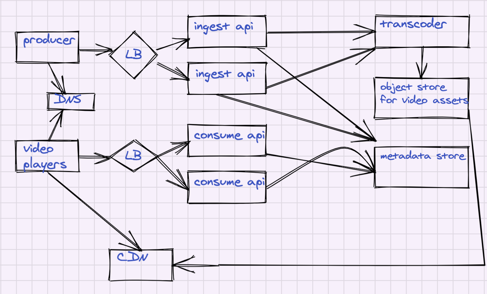

# CHAPTER 14: DESIGN YOUTUBE

## Background
YouTube looks simple: content creators upload videos, and viewers click play. But under the hood, a lot is going on. The biggest challenges are scalability, reliability, and fault tolerance.  

## Requirements

### Functional 
- Upload video
- Watch Video
- Clients to support:
    - Mobile apps
    = Web Browsers
    - Smart TV
- Support international users

### Non-Functional
- Capacity:
    - The total number of monthly active users: 2 billion
    = The number of videos watched per day: 5 billion
    - 50 million creators on YouTube
    - Average daily time spent on the product is 30 mins
    - Support multiple video resolution
    - Max file size is 1GB
- Security
    - Require encryption
- Maintainability:
    - Leverage cloud services

## System APIs
- Upload Video
= Search for Video
= Watch Video
- Like Video
- Create List
- Subscribe to a channel

## High-Level Design
Define components and data flows 

<table width="1024px">
  <tr>
    <td></td>
  </tr>
</table>

## Detailed Design

### Ingest API
Ingest API allows uploading new video files to the System. The flow is simple, youtube users performs authentication and then upload video files (up to 1GB). Once vide files land in the raw data storage, the System performs transcoding. 

### Transcoder
The Transcoder Service takes a file and creates slices in different resolutions. For example, given a 4K video file, it creates slices of 4s each for UHD, HD and SD resolutions.

### Video Store
Any distributed object store can be used for storing video slices. In this example we will use AWS S3. We create a folder for each video. Under the main folder, we create UHD, HD, and SD subfolders. Each subfolder will contain slices (4sec video files).

### CDN
CDN delivers video files to the end user's players from the closest CDN edge. We can use a built-in property of the AWS CloudFront when AWS S3 is used as the origin, and CDN will play the role of cache.

### Metada Store
Once video slices are in place, we create a manifest (a playlist). Video players load manifest and play video files one by one. Any document database can be used to implement the metadata store. For example it can be MongoDB, DynamoDB, ElasticSearch

### Consumer API
Consumer API is a playback facade. Players load playlists from the Consumer API.

## Analysis
- Cost
- Security
- Reliability
- Performance Efficiency
- Operation Excellence

