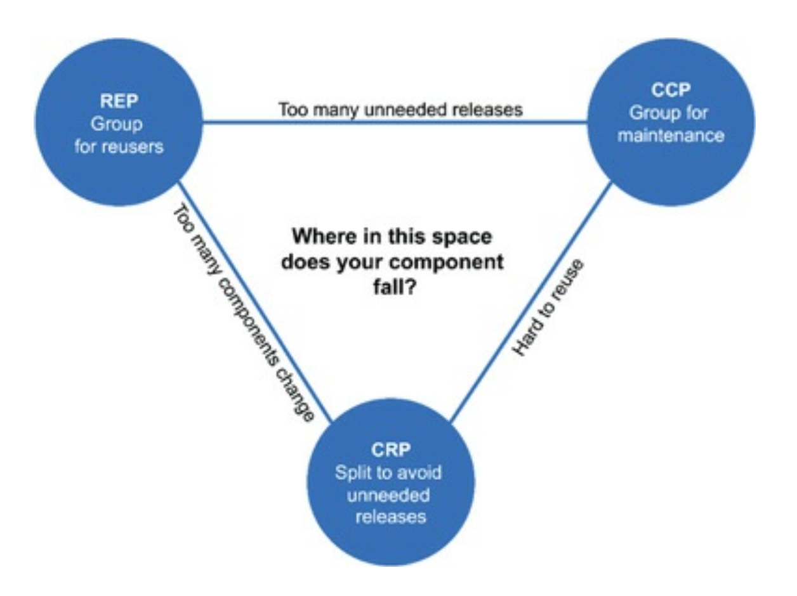

# Components Principles
If the SOLID principles tell us how to arrange the bricks into walls and rooms, then the component principles tell us how to arrange the rooms into buildings. Large software systems, like large buildings, are built out of smaller components.

## Components
Software Components are deployment units. Jars in Java, Dlls in .NET. In interpreted languages it can be zip with sources, like in python. In C++ platform it is platform depended. On Windows OS it will be .dll, in Unix like these are ELF and .so.

## Components Cohesion
Which classes belong to which components? 

### The Reuse/Release Equivalence Principle 
REP - classes and modules that are formed into a component should serve the same purpose and should be releasable together

### The Common Closure Principle
CCP - states that the component should not have multiple reasons to change

### The Common Reuse Principle
CRP - do not force users of the component to be depended on things that they do not need

<table width="256px">
  <tr>
    <td></td>
  </tr>
  <tr><td align="center">Cohesion Principles Tension Diagram</td></tr>
</table>  

## Components Coupling

