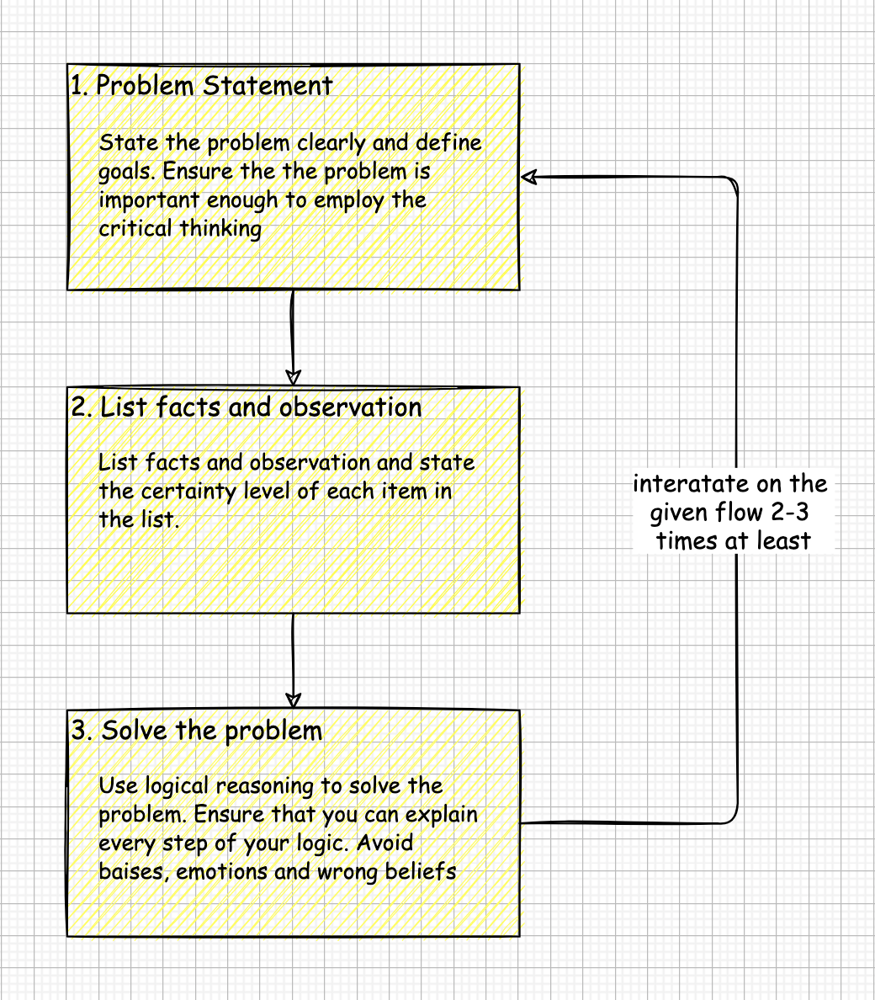

# CRITICAL THINKING IN A NUTSHELL

## What is Critical Thinking
Critical thinking is the analysis of facts, observations, and arguments to form a judgment. 

## Critical Thinking Framework

## The Evolution of Critical Mind
What are a critical thinker's traits? How to identify the critical thinker? And more important, how to become a critical thinker by yourself? Some traits of the Critical Thinker are:

### 1. Truth-Seeker and Open-Minded
A Critical Thinker seeks to reveal the true nature of things. He gathers information from different sources, even when he doesn't like the source of information. 

### 2. Systematic and Analytical
A systematic person will actively seek to work through his actions carefully and methodically. by designing and executing a detailed plan. An analytical mind is capable of both locating problems and solving them. A critical thinker will remain focused on the most important components rather than get lost in the details.

### 3. Emotional Maturity and Self Confidence
A Critical Thinker is willing to confidently support true and logical opinions in the face of significant social opposition.
Critical Thinkers accept the fact, that the new information can undermine the long-held beliefs.

## Barriers to Critical Thinking
Critical thinking is a time-consuming way to solve problems. We prefer to spend less time, and we solve problems using <b>intuition and beliefs</b>. In addition, sometimes we are making decisions <b>emotionally</b> or having <b>biases</b> towards one or another solution. The truth is that for most cases, it is just fine. We should employ critical thinking only for important and complicated decisions.       

## Applying Critical Thinking 

<table width="256px">
  <tr>
    <td></td>
  </tr>
  <tr><td align="center">Applying Critical Thinking</td></tr>
</table>  

## Mental Exercise to develop Critical Thinking
One of the best exercises to practice Critical Thinking is news review. Social Media and different news websites have exposed us to a lot of information and disinformation. To make sense of the chaos, we can apply Critical Thinking in the following way
### 1. Problem Statement 
Choose the topic and define the goal. Examples:   
  - Who is right in a conflict between A and B. 
  - What is the right investment strategy after the change of regulations.
### 2. Fact, Observations, and Open Questions
Read 2-4 articles on the topic from sources representing different opinions. List facts and observations on the topic. 
Set an accuracy grade for each fact and observation. For example, 100% will be given to any item that is based on data or comes from a highly reliable source. Any shameless lie will get 0%. Add open questions to the list. Research and try to answer them.
### 3. Solution 
Use logical reasoning to solve the problem. If there are missing data, add questions to the list from 2 and repeat the process from the beginning.
