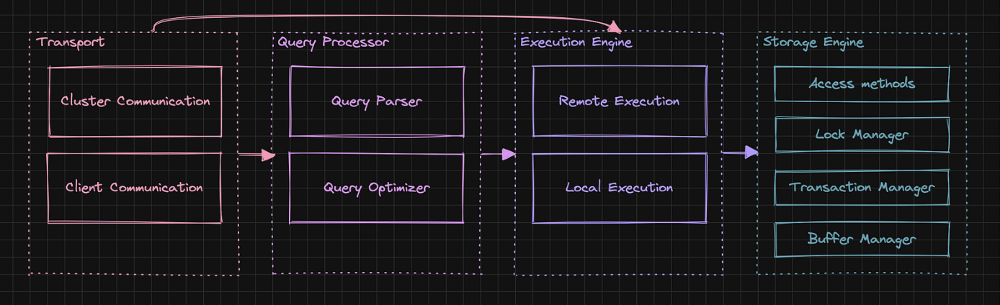
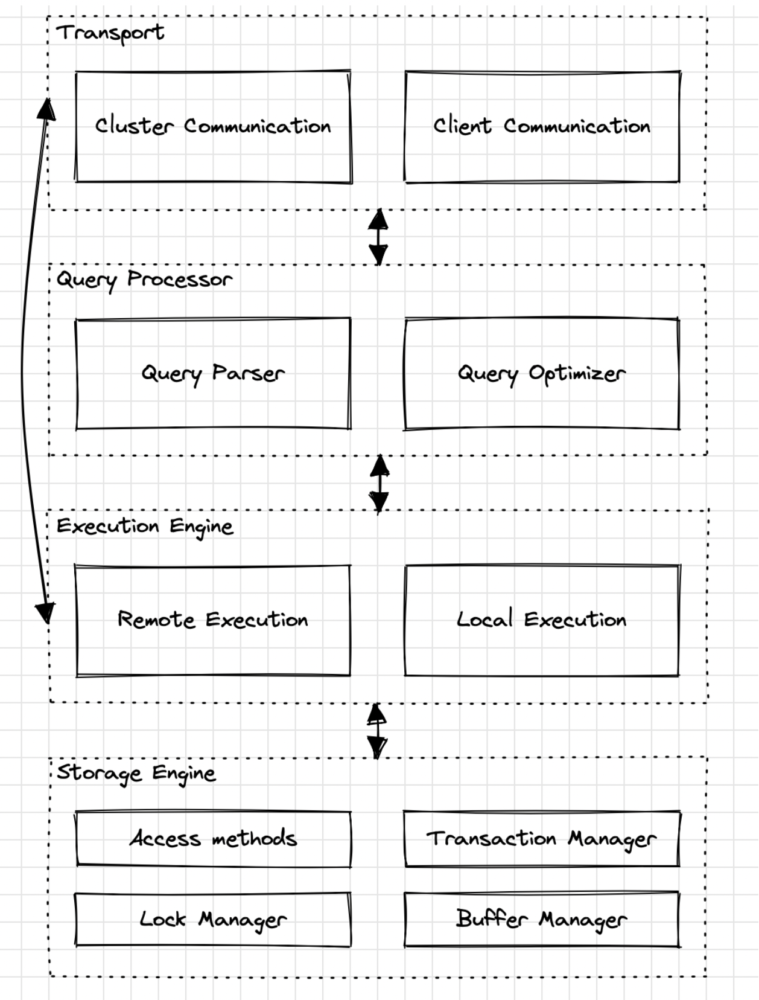
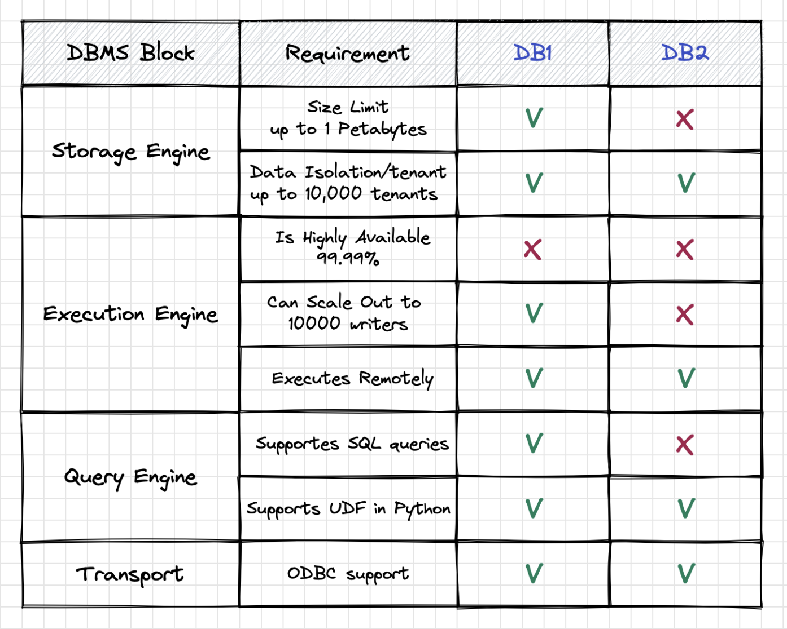

# A Bottom-Up Approach for Choosing the Right Database for your workload

<table width="256px">
  <tr>
    <td></td>
  </tr>
  <tr><td align="center">DBMS Foundation Blocks</td></tr>
</table>

## Background
Choosing the right database for a software application can be a critical decision as it can impact the performance, scalability, and functionality of the application. One of the main challenges when choosing a database is the wide range of database options available, each with its own strengths, weaknesses, and specific use cases. Relational databases, NoSQL databases, in-memory databases, graph databases, and more offer different features and trade-offs. Understanding the nuances of each type and selecting the one that best suits your application's needs can be complex and time-consuming. This document shows the bottom-up approach that can be time-efficient for choosing the right database for a specific workload.

## A Bottom-Up Approach
A bottom-up approach for choosing the right database involves starting with an understanding of databases foundations and working the way up to selecting the database that best fits specific workload requirements.

### DBMS Foundation Blocks
There is no common blueprint for database system design. Every database is built slightly differently. But all databases have four common foundation blocks that form the backbone of a DBMS, and each plays a critical role in ensuring the performance, reliability, and security of the database.

<table width="256px">
  <tr>
    <td></td>
  </tr>
  <tr><td align="center">DBMS Foundation Blocks</td></tr>
</table>

- Transport: The transport layer in a DBMS is responsible for handling the communication between the database server and client applications. It provides the means for transmitting data and queries between the two, and handles tasks such as network protocol implementation and connection management.
- Query Processor: The query processor is responsible for interpreting user queries and transforming them into a format that can be executed by the database. It consists of multiple components such as the parser, query optimizer, and query executor, and is responsible for generating an efficient execution plan to retrieve the requested data.
- Execution Engine: The execution engine is responsible for carrying out the query execution plan generated by the query processor. It retrieves data from the storage engine, applies any necessary operations such as filtering, sorting, or aggregating, and returns the result set to the client.
- Storage Engine: The storage engine is responsible for managing the physical storage of the database on disk or in memory. It is responsible for implementing data structures such as tables, indexes, and views, as well as enforcing data integrity constraints such as uniqueness and referential integrity. It also handles operations such as data insertion, deletion, and modification.

### Workload Requirements
The next step is to create a comprehensive requirements list that captures all available information about the specific software application. The list should include functional and non-functional requirements, system constraints, scalability targets, performance expectations, and any other relevant details like the development team skillset, time to market expectation, etc. Requirements should be clear, specific, measurable, and prioritized based on their importance, impact, and feasibility.

<i>Measurable software requirements are specific, quantifiable, and objective criteria that can be measured or evaluated to determine whether they have been met. They are defined in a way that allows for a clear and unambiguous assessment of their fulfillment. Measurable requirements are crucial for effective testing, verification, and validation of software systems.</i>

Once application requirements are collected, you can establish traceability between the application requirements list and Database Foundation blocks.

### Establishing Requirements Traceability
Now, we can analyze the software requirements and identify which database components are responsible for fulfilling each requirement. Creating a mapping matrix or document that links each requirement to the corresponding third-party component can help a lot for analysis. Here is a specific example of establishing traceability by using an RTM (Requirements Traceability Matrix):

<table width="256px">
  <tr>
    <td></td>
  </tr>
  <tr><td align="center">DBMS Foundation Blocks</td></tr>
</table>

### A Concrete Example
A Requirements Traceability concept can be challenging to grasp, so let's go through the concrete example of picking the right Database Management System for a Multitenant Data Pipeline.  
 <i>
Given a multi-tenant batch data pipeline consisting of 4steps: Data Ingestion, Data Processing(ETL), Data analysis, and Reporting. The data pipeline runs once each 4h. The scalability targets are 100,000 tenants, 1PT of data in storage, and processing up to 100GB in each cycle. The data pipeline is hosted on AWS and the development team consists of Data engineers that are proficient in Python, SQL, and relational databases. What AWS Managed Database can be a good match for the given project?
</i>   
AWS has a lot to offer when it comes to Database Managed Services: AWS RDS (MySQL, PostgreSQL, Aurora), AWS DocumentDB, AWS DynamoDB, AWS Redshift, AWS Neptune, AWS Timestream, AWS ElasticCache, and more. And of course, there is an option to build your 'own' database by using distributed object store AWS S3, Glue Catalog (data indexing and schema), and a query engine AWS Athena or Apache Spark. It is really easy to get lost and spend a lot of time learning and trying all of these services. 
By using an RTM, we eliminate most AWS Managed Databases really quickly. Just by linking the storage requirement of 1PT size limit and analyzing the Storage Engine of AWS Managed Databases, all the following DB are out of the game: RDS databases (all of them), AWS DocumentDB, AWS ElasticCache (Redis), AWS Neptune. When linking the requirement for supporting SQL and analyzing the Query Engine, we see that only two databases can match the requirements - AWS Redshift and a 'custom' DB that built from AWS S3, Glue Catalog, and Athena.

### Summary
Choosing the right database requires careful evaluation, analysis of specific project requirements, and prototyping or testing with different databases to determine the best fit. By applying the bottom-up approach outlined above, you can streamline the research process and focus on the most relevant databases only, ultimately reducing the time and effort required to choose the right database for your workload.

