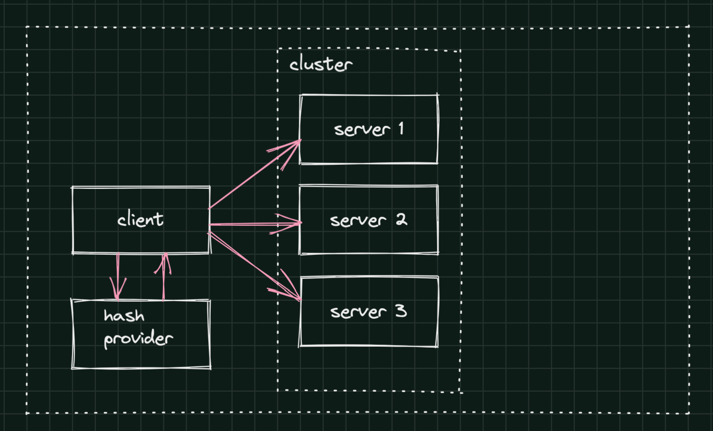
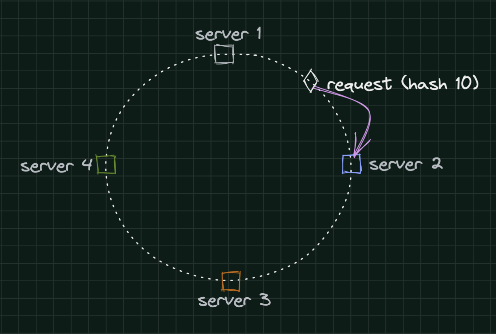
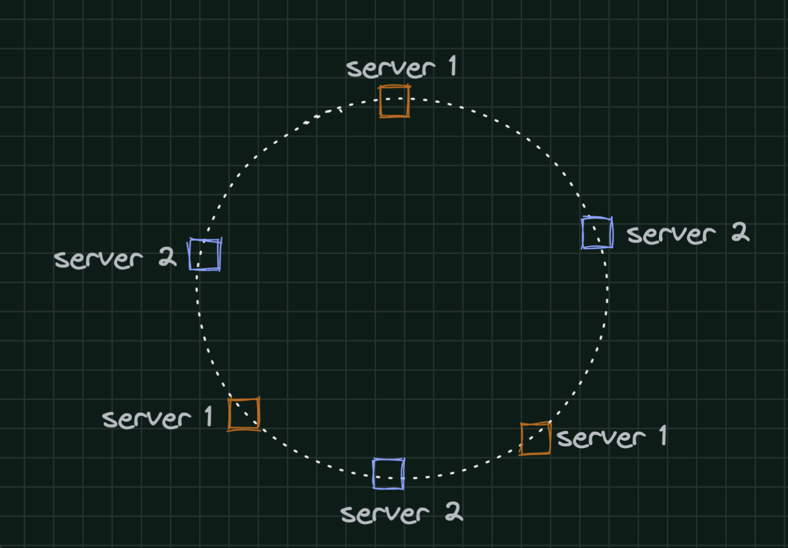

# CHAPTER 5: DESIGN CONSISTENT HASHING

## Background
it is important to distribute requests/data efficiently and evenly across servers to achieve a horizontal scaling. Consistent hashing is a commonly used technique to achieve this goal. But first, let us take an in-depth look at the problem. Consistent hashing is a commonly used technique to achieve this goal.

## Requirements

### Functional 
- Given N servers, find a technique to balance the load between servers. For example: server_index = hash(key) % N  
- Support removing and adding servers to the Pool
- Consider uneven data distribution

### Non-Functional
N/A

## System APIs
- hash(key: string) -> int: hash function gets a string as a key and returns the server index.

## High-Level Design
The flow is simple: any client working with a Cluster holds a reference to a Hash Provider. A Hash Provider holds a seed(list of servers in a cluster) and contains an implementation of the hashing function. Before calling the cluster, the client performs hashing on a given key, and gets the server to send the requests.

<table width="256px">
  <tr>
    <td></td>
  </tr>
</table>

## Detailed Design 
[Consistent hashing](https://en.wikipedia.org/wiki/Consistent_hashing): is a special kind of hashing such that when a hash table is re-sized and consistent hashing is used, only k/n keys need to be remapped on average, where k is the number of keys, and n is the number of slots. In contrast, in most traditional hash tables, a change in the number of array slots causes nearly all keys to be remapped.  Consistent hashing can be desrcibed by two fundamental steps:
  - Map servers and requests to a given range of values by using uniformly distributed hash function
  - To find the destinadtion server for a given request, go clockwise to the next server    

Example: givem 4 servers mapped to {0, 90, 180 270} and the request mapped to 10, the destination server is server 2 (hashed to 90). After removing the server 2, all valued will be copied to 3 (180).
<table width="256px">
  <tr>
    <td></td>
  </tr>
</table>

In this apporach we can see a distribution problem. What happens when servers hash values are not uniformly distributed? In real life, each server will be given many values (virtual nodes). For example, see the ring for two nodes, when each node has 3 virtual nodes.
<table width="256px">
  <tr>
    <td></td>
  </tr>
</table>

## Analysis
- Cost
- Security
- Reliability
- Performance Efficiency
- Operation Excellence